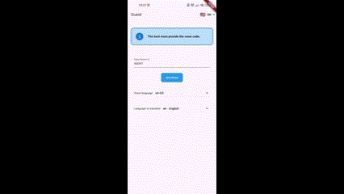

# Continuous Translation for Meetings

## Project Overview

This project is designed to facilitate events like TED Talks, conferences, meetings, and similar gatherings where a host (speaker) creates a room and others join as guests. The host speaks in one language, and guests can choose to receive translations in their preferred language. The system currently supports a 32-bit ARMv7 architecture, with plans to expand to a 64-bit architecture in the future.

---

## Host and Guest Demo (Frontend)

<div style="background-color: #e7f0ff; border-left: 5px solid #007bff; padding: 15px; margin-bottom: 20px; color: #004085;">
    <strong>ℹ️ Important Information:</strong> The GIF visual demonstrations may appear lower in quality compared to the actual videos. For a clearer and more detailed view with better audio translation, please check the YouTube links provided below.
</div>

&nbsp;

<table style="width: 100%; border-collapse: collapse;">
  <tr>
    <td style="padding: 10px; vertical-align: top; text-align: center; width: 50%;">
      <h3>Host Demo (Web)</h3>
      <p><strong>Responsibilities:</strong> The host creates a room and selects the language for input. This is done through the web interface.</p>
      
      <br>
      <a href="https://youtu.be/RgRMhfmq0Ew" target="_blank" style="display: inline-block; padding: 10px 15px; background-color: #007bff; color: white; text-decoration: none; border-radius: 5px;">See demo video on YouTube</a>
    </td>
    <td style="padding: 10px; vertical-align: top; text-align: center; width: 50%;">
      <h3>Guest Demo (Mobile Android/iOS)</h3>
      <p><strong>Responsibilities:</strong> The guest enters the room code and selects the target language for translation, including voice language or accents.</p>
      
      <br>
      <a href="https://youtu.be/ODbYDyy6c2k" target="_blank" style="display: inline-block; padding: 10px 15px; background-color: #007bff; color: white; text-decoration: none; border-radius: 5px;">See demo video on YouTube</a>
    </td>
  </tr>
</table>

## Host and Guest Deployment (Frontend)

### Host Web (Chrome)

1. **Deploy the Web Application:**

    - The host interface is a web application that should be deployed on an Web server, I used Nginx.

2. **Deployment Steps (Nginx):**

    - Copy the contents of `front/host_translator/deploy_web/web` to the Linux Nginx server directory `/var/www/html`.

### Guest (Mobile Android/iOS)

1. **Use the Mobile Application:**

    - Guests will use a mobile application available for Android/iOS devices. The APK for the mobile application is currently not provided and will be updated in the future.

---

## Server Deployment (Raspberry Pi OS - Legacy 32-bit) (Backend)

### Server Responsibility

The server component is responsible for managing rooms created by the host. Once a room is created, guests can join and select their preferred translation.

### Deployment Steps

1. **Navigate to the Server Directory:**

    - Move to the `back` directory in your project.

2. **Launch the Server:**

    - Use Docker Compose to start the server with the `docker-compose.yml` file.

    ```bash
    docker-compose up -d
    ```

---
